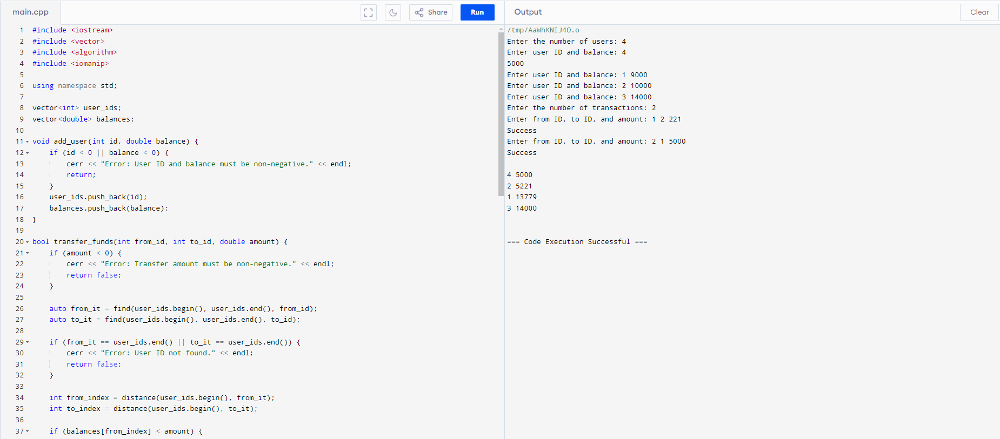

# Digital Wallet Management System


## Project Description
A digital wallet management system implemented in C++ that allows users to manage their wallet accounts, perform fund transfers, and view account balances. The system supports basic account operations and transactions.

## Table of Contents
- [Prerequisites](#prerequisites)
- [How to Install and Run the Project](#how-to-install-and-run-the-project)
- [How to Use the Project](#how-to-use-the-project)
- [Include Tests](#include-tests)
- [Screenshots/Media](#screenshotsmedia)
- [Future](#future)
- [How to Contribute to the Project](#how-to-contribute-to-the-project)
- [License](#license)
- [Credits](#credits)
- [Author](#author)
- [Conclusion](#conclusion)
- [Connect with Me](#connect-with-me)

## Prerequisites
- **C++ Compiler**: GCC or Clang.
- **C++ Standard Library**: Typically included with the compiler.
- **CMake** (optional): For building with CMake.

## How to Install and Run the Project
1. **Clone the Repository**:
   First, clone the repository to your local machine:
   ```sh
   git clone https://github.com/AnirudhAravalli/Digital-Wallet-Management-System.git

2. **Navigate to the project directory:**
    ```sh
   cd Digital-Wallet-Management-System

3. **Compile the project:**
   ```sh
   make all

5. **Run the application:**
   ```sh
   ./Digital_Wallet_Management_System


## How to Use the Project
After launching the application, you will be prompted to:
1. **Add Users**: Enter user IDs and balances.
2. **Transfer Funds**: Specify the sender, receiver, and amount.
3. **View User Balances**: Check the balance of any user by entering their user ID.

## Include Tests
This project currently does not contain automated tests. To test the system, you can manually input data as described in the [How to Use the Project](#how-to-use-the-project) section

## Screenshots/Media

*Main interface of the Digital Wallet Management System showing user interactions.*

## Future Improvements
- **User Authentication**: Implement login functionality for added security.
- **Transaction History**: Add a feature to view past transactions.
- **Multi-Currency Support**: Allow transactions in different currencies.

## How to Contribute to the Project

Contributing to this project is straightforward, follow these steps:

1. **Fork the Repository**: Create a personal fork of the repository. This is your own workspace where you can make changes without affecting the original project.

2. **Create a New Branch**:
   Use the following Git command to create a new branch for your features or fixes:
   git checkout -b feature/new-feature

3. **Make Changes**: Implement your changes or add new features in your branch. Make sure your changes are well-documented and follow the project's coding    standards.

4. **Submit a Pull Request**:
   After making your changes, push them to your fork and then submit a pull request to the original repository. Use the following commands:
   git push origin feature/new-feature

## License
This project is licensed under the MIT License - see the [LICENSE.md](LICENSE.md) file for details.

## Credits

- **f(Y)_Solutions**: For providing the training module.
- **Contributors**: 
  - [HemaSri Modiyam]((https://github.com/HemasriModiyam))

## Author

HemaSri Modiyam - [hemasrimodiyam104@gmail.com](mailto:hemasrimodiyam104@gmail.com)

## Conclusion

Thank you for checking out the Digital Wallet Management System. Feel free to contribute and provide feedback!

## Connect with Me

- [GitHub](https://github.com/HemasriModiyam)
